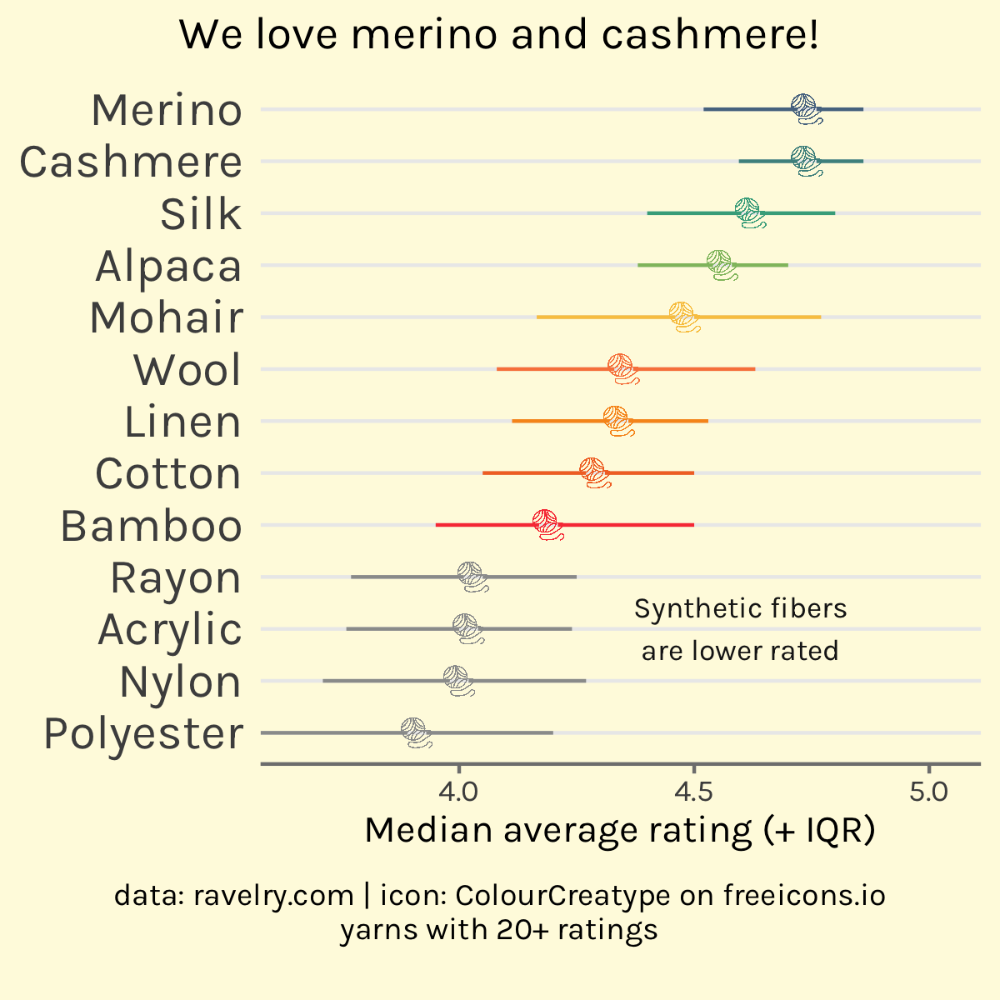

# ravelry_yarns
Data from the ravelry.com yarn database

# data

This was assembled as in [code/get_data.R](code/get_data.R). The data was updated last on March 26, 2024.

The resulting csv is [data/yarn.csv](data/yarn.csv)

There are two additional csv files that have additional data on the yarns:

- yarn_fibers.csv
- yarn_attributes.csv

# data dictionary

This was assembled in [code/make_dictionary.R](code/make_dictionary.R) and can be found in [data/yarn_dictionary.csv](data/yarn_dictionary.csv)

|name                      |type      |description                                                      |
|:-------------------------|:---------|:----------------------------------------------------------------|
|discontinued              |logical   |Is the yarn discontinued                                         |
|gauge_divisor             |integer   |The number of inches that equal min_gauge to max_gauge stitches  |
|grams                     |integer   |Unit weight                                                      |
|id                        |integer   |Unique identifier for the yarn                                   |
|machine_washable          |logical   |Is the yarn machine washable                                     |
|max_gauge                 |numeric   |The max number of stitches that equal gauge_divisor              |
|min_gauge                 |numeric   |The min number of stitches that equal gauge_divisor              |
|name                      |character |Name of the yarn                                                 |
|permalink                 |character |The permalink to https://www.ravelry.com/yarns/library/permalink |
|rating_average            |numeric   |The average rating out of 5                                      |
|rating_count              |integer   |                                                                 |
|rating_total              |integer   |                                                                 |
|texture                   |character |Texture free text                                                |
|thread_size               |character |Thread size                                                      |
|wpi                       |integer   |Wraps per inch                                                   |
|yardage                   |integer   |                                                                 |
|yarn_company_name         |character |                                                                 |
|yarn_weight_crochet_gauge |character |Crochet gauge for the yarn weight category                       |
|yarn_weight_id            |integer   |Identifier for the yarn weight category                          |
|yarn_weight_knit_gauge    |character |Knit gauge for the yarn weight category                          |
|yarn_weight_name          |character |Name for the yarn weight category                                |
|yarn_weight_ply           |character |Ply for the yarn weight category                                 |
|yarn_weight_wpi           |character |Wraps per inch for the yarn weight category                      |
|texture_clean             |character |Texture with some light text cleaning                            |

### TidyTuesday

This data was used for [#tidytuesday](https://github.com/rfordatascience/tidytuesday) week 41! 

## Other ways to work with ravelry data

There is a [ravelRy](https://github.com/walkerkq/ravelRy) R package!

## Example plot

See the [explore_yarn.R](code/explore_yarn.R) file to see how to plot the relationship between
fiber content and average rating.

